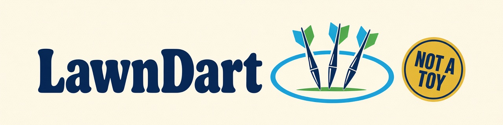

<h1 align="center">
  <picture>
    <source media="(prefers-color-scheme: dark)" srcset="assets/banner-dark.png">
    <source media="(prefers-color-scheme: light)" srcset="assets/banner-light.png">
    
  </picture>
</h1>

In-process .NET library for event-sourced **commands**, **events**, and **state**.

[](LICENSE)
[](https://dotnet.microsoft.com/download/dotnet/10.0)
[](CHANGELOG.md)

LawnDart is a standalone command–event–state runtime: aggregates and Dynamic
Consistency Boundaries, an event store (InMemory or SQL Server), lightweight
projections, messaging, ASP.NET Core command mapping, and a given/when/then
test harness.

Packages are on [nuget.org](https://www.nuget.org/packages?q=LawnDart)
as a prerelease (`0.1.0-alpha.1` and later). Use `--prerelease` until a
stable version exists. Package versions are derived from git tags (see
[Releasing](CONTRIBUTING.md#releasing)).

## Requirements

- [.NET 10 SDK](https://dotnet.microsoft.com/download/dotnet/10.0)
- Docker Desktop — only for SQL Server integration tests (Testcontainers)

## Features

- Command / event / state types and the nine CES patterns (aggregates, DCB,
  projections, reactions, processors)
- `AddBoundedContext` + `UseInMemory()` with no infrastructure
- Durable SQL Server store, outbox, and lightweight projections
- ASP.NET Core HTTP command mapping and optional claims-based authorization
- In-process messaging and `LawnDart.Testing` BDD harnesses

## Packages

| Package | Role |
|---|---|
| `LawnDart` | Core contracts (`ICommand`, `IEvent`, `IState`, aggregates, DCB) |
| `LawnDart.EventSourcing` | Runtime and InMemory event store |
| `LawnDart.EventSourcing.SqlServer` | Durable SQL Server store |
| `LawnDart.Projections.Lightweight` | Read-model host |
| `LawnDart.Messaging` / `LawnDart.Messaging.InMemory` | Reactors and in-process transport |
| `LawnDart.AspNetCore` | HTTP command mapping |
| `LawnDart.Authorization.AspNetCore` | HTTP claims → authorization context |
| `LawnDart.Testing` | Given / when / then harnesses |

Details: [Package map](docs/packages/README.md).

## Install

```bash
dotnet add package LawnDart --prerelease
dotnet add package LawnDart.EventSourcing --prerelease
```

Add the other packages from the table above as you need them, each with
`--prerelease`.

To work on this repository, clone and restore:

```bash
git clone https://github.com/sellistixorg/LawnDart.git
cd LawnDart
dotnet restore
dotnet build
```

## Quick start

Register the host:

```csharp
services.AddLawnDart(o => o.RequireTenantId = false);
services.AddBoundedContext("default").UseInMemory();
```

Run Academy (zero infrastructure):

```bash
dotnet run --project demos/LawnDart.Demo.Academy
```

Optional SQL Server profile and WebApi are documented in [docs/QUICKSTART.md](docs/QUICKSTART.md).
Backend choice: [docs/BACKEND_SELECTION.md](docs/BACKEND_SELECTION.md).

## Documentation

- [Documentation site](https://sellistixorg.github.io/LawnDart/)
- [Start here](docs/START_HERE.md)
- [Overview](docs/OVERVIEW.md)
- [Quickstart](docs/QUICKSTART.md)
- [Learning path](docs/learning-path/README.md)
- [Glossary](docs/GLOSSARY.md)

## Status

Versioning follows [SemVer 2.0.0](https://semver.org/spec/v2.0.0.html). The
project is pre-1.0: a **minor** bump may contain breaking changes to the public
API. Only tagged releases are supported; untagged builds are development
artifacts. See [CHANGELOG.md](CHANGELOG.md).

## Modelling companion

[Eventhesis](https://eventhesis.com) is a separate event-modelling tool that can
target LawnDart. You do not need it to use this library.

## Contributing

See [CONTRIBUTING.md](CONTRIBUTING.md). Please follow the
[Code of Conduct](CODE_OF_CONDUCT.md).

## Security

Report vulnerabilities to **security@sellistix.com**. Do not open a public
issue. Details: [SECURITY.md](SECURITY.md).

## License

[MIT](LICENSE) © 2026 Sellistix LLC
