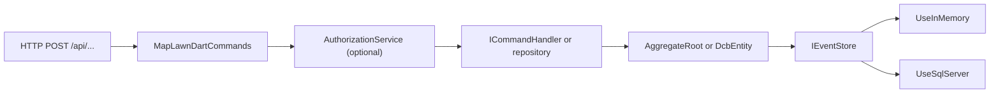

# Command path

```mermaid
flowchart LR
    HTTP["HTTP POST /api/..."] --> Map["MapLawnDartCommands"]
    Map --> Auth["AuthorizationService (optional)"]
    Auth --> Handler["ICommandHandler or repository"]
    Handler --> Agg["AggregateRoot or DcbEntity"]
    Agg --> Store["IEventStore"]
    Store --> IM["UseInMemory"]
    Store --> SQL["UseSqlServer"]
```

Commands without auth attributes skip the check. HTTP claims require
`AddHttpAuthorizationContext`.
