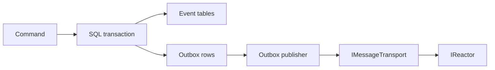

# Outbox

```mermaid
flowchart LR
    Cmd["Command"] --> Tx["SQL transaction"]
    Tx --> Events["Event tables"]
    Tx --> Rows["Outbox rows"]
    Rows --> Pub["Outbox publisher"]
    Pub --> Bus["IMessageTransport"]
    Bus --> Reactor["IReactor"]
```

Use SQL Server plus `EnableOutbox` when the consumer is another process.
InMemory publishes in-process.
