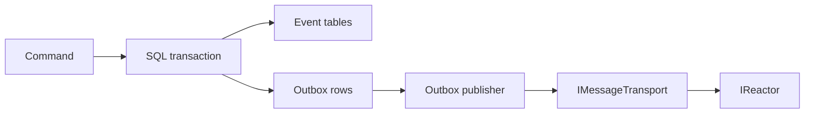

# Outbox

Use SQL Server plus `EnableOutbox` when the consumer is another process.
InMemory publishes in-process. A dead-lettered row returns to the publisher
after `ResetDeadLetteredAsync` or `ResetAllDeadLetteredAsync`. See
[Outbox pattern](../OUTBOX_PATTERN.md#dead-letters).
