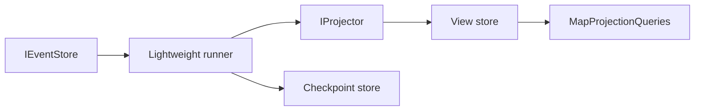

# Projection pipeline

```mermaid
flowchart LR
    Store["IEventStore"] --> Runner["Lightweight runner"]
    Runner --> Proj["IProjector"]
    Proj --> View["View store"]
    Runner --> Cp["Checkpoint store"]
    View --> GET["MapProjectionQueries"]
```

Stores are InMemory (`AddInMemoryProjectionStores`) or SQL
(`AddSqlProjectionStores`).
