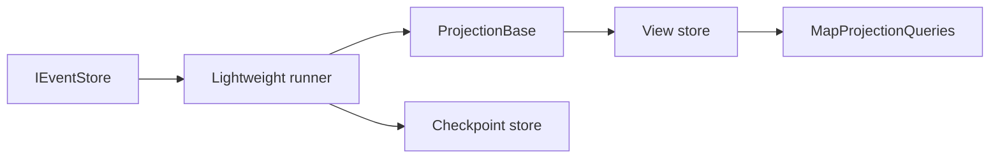

# Projection pipeline

```mermaid
flowchart LR
    Store["IEventStore"] --> Runner["Lightweight runner"]
    Runner --> Proj["ProjectionBase"]
    Proj --> View["View store"]
    Runner --> Cp["Checkpoint store"]
    View --> GET["MapProjectionQueries"]
```

The runner applies `ProjectionBase<TView>` handlers. Stores are InMemory
(`AddInMemoryProjectionStores`) or SQL (`AddSqlProjectionStores`).
